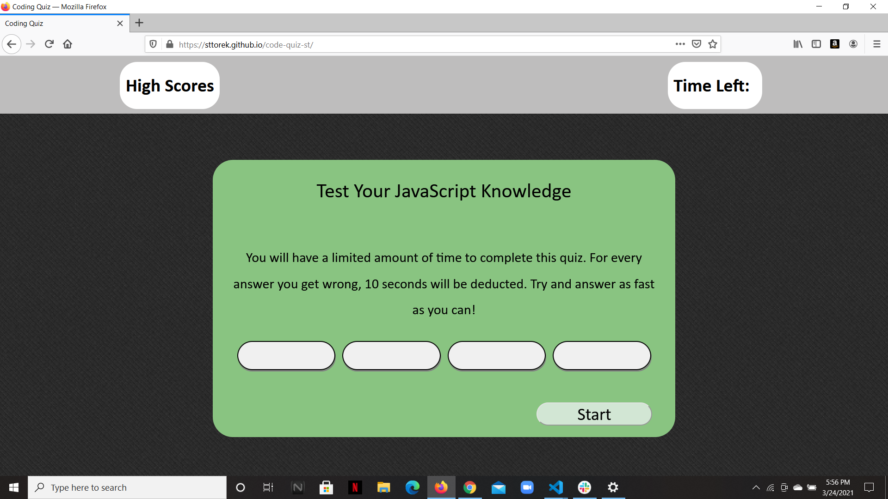

# code-quiz-st

In this activity I've created a timed JavaScript quiz. If you click the wrong answer, seconds are deducted from your time. Once finished you can log your high score.

site-https://sttorek.github.io/code-quiz-st/

